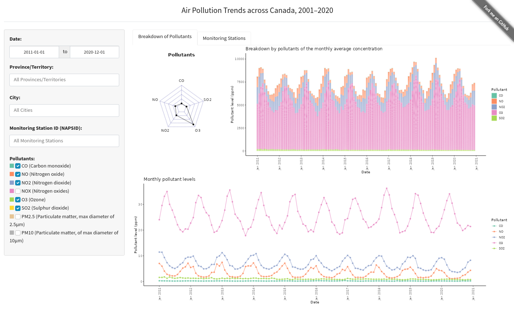

# Air Pollution in Canada

> Authors: Elena Ganacheva, Ritisha Sharma, Ranjit Sundaramurthi, Kelvin Wong
>
> Project complete in accordance with DSCI 532 for the UBC MDS Program 2022-23 for Group 13

## About

For information on the intention, research questions, as well as a more detailed description of the data, please read the [proposal](reports/proposal.md) instead.

The objective of this dashboard it to enable users to make inferences on the the air pollution trends in Canada between 2001 to 2020. These inferences are conveniently put in perspective by displaying comparisons with world metrics.



The landing page presents the user with options on the left side to select a Province in Canada or/and a specific City in Canada via drop-down menus. The pollutants of interest can be selected via checkboxes. By default, these options are set as entire Canada and all pollutants. This corresponds to the following selections, Select Province: "All" , Select City: Inactive, Select Pollutant: "All".

These selected options dynamically update the Line chart in the display zone 1 on the far right. This plot shows a comparison of average concentration (parts per million) of the prominent pollutants in Canada against the World. The default range of year for this chart is from 2001 to 2020. The user can alter this range by using a slider widget placed beneath this display zone. Furthermore, the user can switch between a Line Chart or Stacked Bar Chart option by clicking the respective buttons at the top of this display zone. Clicking either button fills the display zone 1 with the respective chart. At any moment only one type of chart is displayed in this zone allowing the user to fully immerse in the details.z

The dashboard flaunts another display zone 2 at the center wherein the geospatial information is shown. This information dynamically updates based on the selected options in cohesion with the line or bar chart. This zone is divided into two halves. The upper half displays the density of selected air pollutants in the selected province or city in Canada. The bottom half displays the country-wise average density of the selected pollutants.

The dashboard provides definitions of the pollutants, model assumptions and a summary to provide an overall insight. The attributions and credits are enlisted for user convenience.

## Usage

The latest version of the dashboard is [deployed on `shinyapps.io`](https://extra.shinyapps.io/air-pollution).

On it, you could experiment with 20 years of [National Air Pollution Surveillance (NAPS)](https://www.canada.ca/en/environment-climate-change/services/air-pollution/monitoring-networks-data/national-air-pollution-program.html) data (2001-2020) (aggregated to the month). Feel free to slice it and see if you could find some insights out of it.

## Running Locally

The project is implemented in R using [Shiny](https://shiny.rstudio.com/).

After setting up the R development environment, install the dependencies by:

```bash
Rscript install-deps.R
```

It can be run by:

```bash
Rscript app.R
```

You can then access the application at the displayed URL. By default it binds to a random local port, but it can be overridden by specifying `PORT` parameter by using:

```bash
PORT=9999 Rscript app.R
```

Interesting in helping out? Read the [`CONTRIBUTING.md`](CONTRIBUTING.md) for more information!

## License

`air-pollution` was created by Elena Ganacheva, Ritisha Sharma, Ranjit Sundaramurthi, and Kelvin Wong.

The [National Air Pollution Surveillance (NAPS)](https://www.canada.ca/en/environment-climate-change/services/air-pollution/monitoring-networks-data/national-air-pollution-program.html) data is published by the [Government of Canada](https://www.canada.ca/), under the terms of [Open Government License - Canada](https://open.canada.ca/en/open-government-licence-canada).

The [OECD Air and GHG emissions](https://data.oecd.org/air/air-and-ghg-emissions.htm) data is published by the [Organisation for Economic Co-operation and Development](https://www.oecd.org/). Its usage is governed by the [OECD Terms and Conditions](https://www.oecd.org/termsandconditions/).

Unless otherwise specified, the materials in this repository are covered under this copyright statement:

Copyright (c) 2023 Elena Ganacheva, Ritisha Sharma, Ranjit Sundaramurthi, Kelvin Wong

The software and associated documentation files are licensed under the MIT License. You may find a copy of the license at [`LICENSE`](LICENSE).
